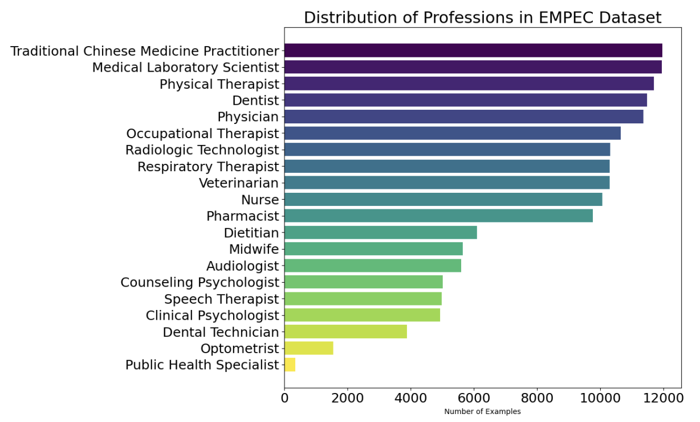

# EMPEC Examinations for Medical Personnel in Chinese

<p align="center">
   📃 <a href="https://arxiv.org/abs/2406.11328" target="_blank">Paper</a> • 🤗 <a href="https://huggingface.co/datasets/KenLuo/EMPEC" target="_blank">HuggingFace</a>  
   <br>  <a href="https://github.com/zhehengluoK/eval_empec/blob/main/README.md"> English
</p>

## ⏫ Update
* **[2024.06.17]** [Paper](https://arxiv.org/abs/2308.08833) released.
* **[2024.06.17]** 🎉🎉🎉 CMB is published！🎉🎉🎉


## 🌐 Download Data

Check out [HuggingFace datasets](https://huggingface.co/datasets/KenLuo/EMPEC) to load our data as follows:
  ```python
  from datasets import load_dataset

    ds = load_dataset("KenLuo/EMPEC")
  ```


## 📖 Dataset intro


EMPEC consists of 157,803 exam questions across 124 subjects and 20 healthcare professions
    


### EMPEC Item 
```json
{
    "subject": "解剖學與生理學",
    "subject_en": "Anatomy and Physiology",
    "profession": "職能治療師",
    "profession_en": "Occupational Therapist",
    "question": "肺臟中進行氣體交換的主要結構稱做： 
    A.肺泡（alveolus） 
    B.氣管（trachea） 
    C.支氣管（bronchus） 
    D.橫膈（diaphragm）",
    "question_en": "The main structure in the lungs where gas exchange takes place is called: 
    A. Alveolus 
    B. Trachea 
    C. Bronchus 
    D. Diaphragm",
    "answer": "A",
},
```

### Evaluation
#### vllm:
1. `python eval.py MODEL_NAME DATA`
2. `python test.py eval_results/MODEL_NAME-DATA.jsonl`

#### Proprietary:
1. `python eval_api.py MODEL_NAME DATA`
2. `python test.py eval_results/MODEL_NAME-DATA.jsonl`

##  Citation
Please use the following citation if you intend to use our dataset for training or evaluation:


```
@article{Luo2024AreLL,
  title={Are Large Language Models True Healthcare Jacks-of-All-Trades? Benchmarking Across Health Professions Beyond Physician Exams},
  author={Zheheng Luo and Chenhan Yuan and Qianqian Xie and Sophia Ananiadou},
  journal={ArXiv},
  year={2024},
  volume={abs/2406.11328},
  url={https://api.semanticscholar.org/CorpusID:270560512}
}
```